# Acoustic FMCW Radar — Contactless Vital Sign Tracking

[](https://www.python.org/)
[](LICENSE)
[]()
[](Acoustic_FMCW_Radar_Simulation_Graphs.pdf)

A modular, production-grade **Acoustic FMCW Radar Signal Processing Suite** implemented in Python for contactless human vital sign tracking (respiration and cardiac micro-motion).

> **Note**: This repository is a 100% software-simulated acoustic FMCW radar pipeline. No physical microphones, speakers, sounddevice, or PyAudio hardware dependencies are required.

---

## 📡 Pipeline Architecture & Modular Packages

```
                                      +---------------------------------------------+
                                      |                   ROLE 1                    |
                                      |   Simulation Acquisition & Forensic Checks  |
                                      |  • rx_audio.npy (48 kHz) | tx_signal.npy    |
                                      |  • Continuous Fractional-Delay Generator    |
                                      |  • Forensic Dataset Cross-Correlation & PSD |
                                      +----------------------+----------------------+
                                                             |
                                                             v
                                      +---------------------------------------------+
                                      |                   ROLE 2                    |
                                      |     FMCW Radar DSP & Multi-Target Tracker   |
                                      |  • Analytic Hilbert Mixing: s_beat = tx*rx* |
                                      |  • Fast-Time FFT -> Range Profile Mapping   |
                                      |  • Static Clutter Cancellation (EMA Filter) |
                                      |  • Multi-Candidate Peak Tracking (0.5-2.0m) |
                                      |  • Multi-Target Verification (0.5, 1.0, 1.5)|
                                      +----------------------+----------------------+
                                                             |
                                                             v
                                      +---------------------------------------------+
                                      |                   ROLE 3                    |
                                      |     Vital Sign Extraction & Stress Tests    |
                                      |  • Target-Bin Phase Extraction & Unwrapping |
                                      |  • Phase-to-Displacement Conversion         |
                                      |  • Zero-Phase Butterworth Bandpass Filters  |
                                      |  • Complex AWGN Noise Robustness (30-5 dB)  |
                                      |  • Motion Artifact Mitigation (Steps/Bumps) |
                                      |  • Spectral BPM & Heart Rate Estimation     |
                                      +---------------------------------------------+
```

---

## 🔬 Mathematical Formulations

### 1. FMCW Range Mapping
For a transmitted linear frequency modulated (LFM) chirp with bandwidth $B = 3000\text{ Hz}$, duration $T_c = 0.10\text{ s}$, and speed of sound $c = 343\text{ m/s}$, the round-trip delay is $\tau = \frac{2R}{c}$.

The instantaneous beat frequency after mixing is:
$$f_{beat} = K \tau = \left(\frac{B}{T_c}\right) \left(\frac{2R}{c}\right)$$

Converting beat frequency to range:
$$R = \frac{c \cdot f_{beat} \cdot T_c}{2 B}$$

For a target at nominal $R = 1.0\text{ m}$:
$$f_{beat} = \frac{2 \times 3000 \times 1.0}{343 \times 0.10} = 174.93\text{ Hz} \approx 175.0\text{ Hz}$$

### 2. Slow-Time Phase-to-Displacement Conversion
At carrier center frequency $f_c = \frac{f_{start} + f_{end}}{2} = 19500\text{ Hz}$ (wavelength $\lambda = \frac{c}{f_c} = 17.59\text{ mm}$), target micro-motion causes phase modulation:
$$\Delta \phi[m] = \frac{4\pi f_c}{c} \Delta d[m]$$

Inverting for physical chest displacement:
$$\Delta d[m] = \frac{c \cdot \Delta \phi[m]}{4\pi f_c}$$

---

## 📊 Visual Results & Diagnostic Graphs

### 1. Transmitted & Received Acoustic FMCW Waveforms
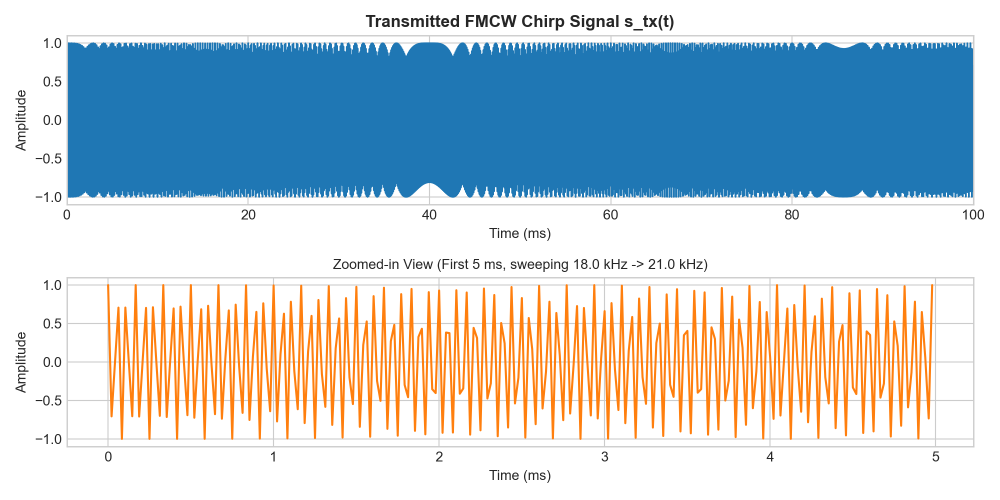
*Figure 1: Transmitted FMCW Chirp Signal ($18\text{ kHz} \rightarrow 21\text{ kHz}$).*

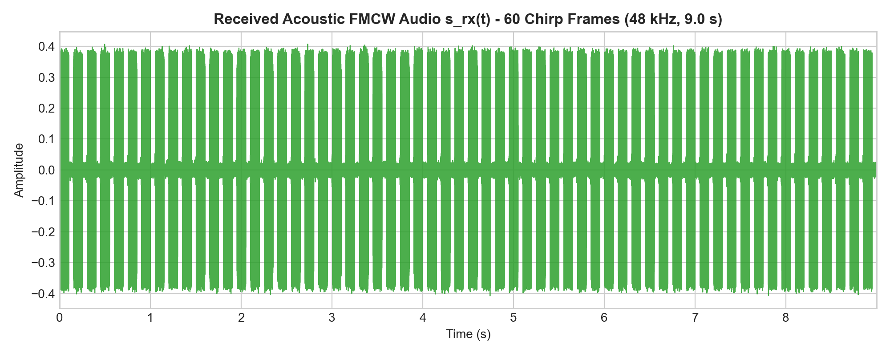
*Figure 2: Complete 60-Frame Received Synthetic Audio Signal ($48\text{ kHz}$, 9.0 s).*

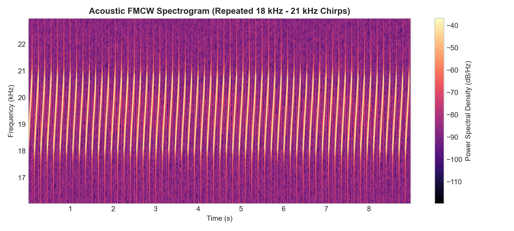
*Figure 3: Time-Frequency Spectrogram showing 60 repeated ultrasonic chirps.*

---

### 2. Fast-Time Range Profile & Peak Detection
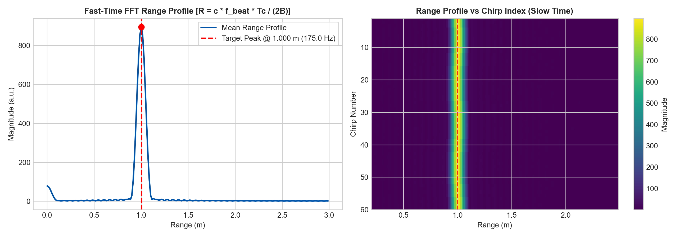
*Figure 4: Left: 1D Fast-Time FFT Range Profile showing detected peak at $1.0004\text{ m}$ ($175.0\text{ Hz}$). Right: 2D Range-SlowTime Heatmap.*

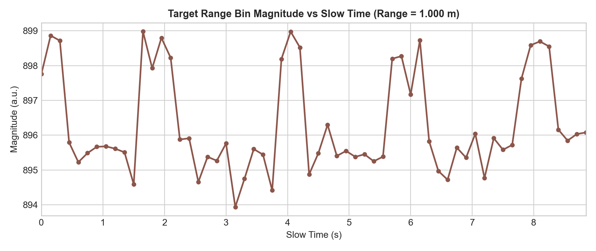
*Figure 5: Magnitude stability of the target range bin across chirps.*

---

### 3. Vital Sign Waveforms & Frequency Spectra

#### Respiration Tracking (Target ~15 BPM)
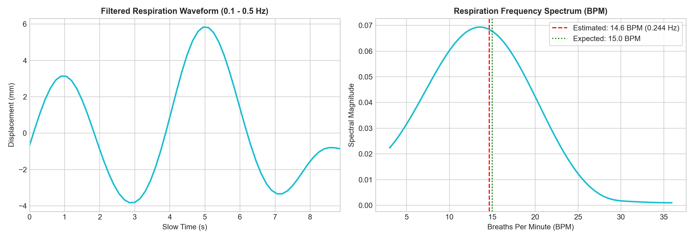
*Figure 6: Bandpass-filtered respiration displacement (0.1–0.5 Hz) and frequency spectrum (Estimated: **14.63 BPM**, Expected: **15.00 BPM**).*

#### Chest Displacement Waveform
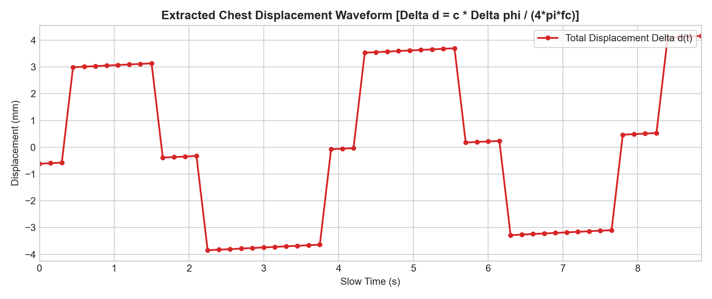
*Figure 7: Extracted chest displacement waveform $\Delta d(t)$ in millimeters.*

---

### 4. Advanced Stress Tests: Noise Robustness & Motion Artifacts

#### Complex AWGN Noise Robustness (30 dB -> 5 dB SNR)
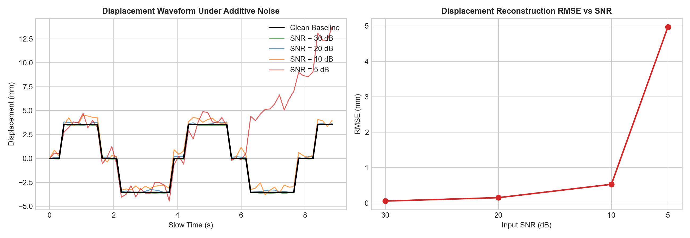
*Figure 8: Displacement recovery and RMSE vs SNR down to 5 dB.*

#### Motion Artifact Detection & Adaptive Mitigation
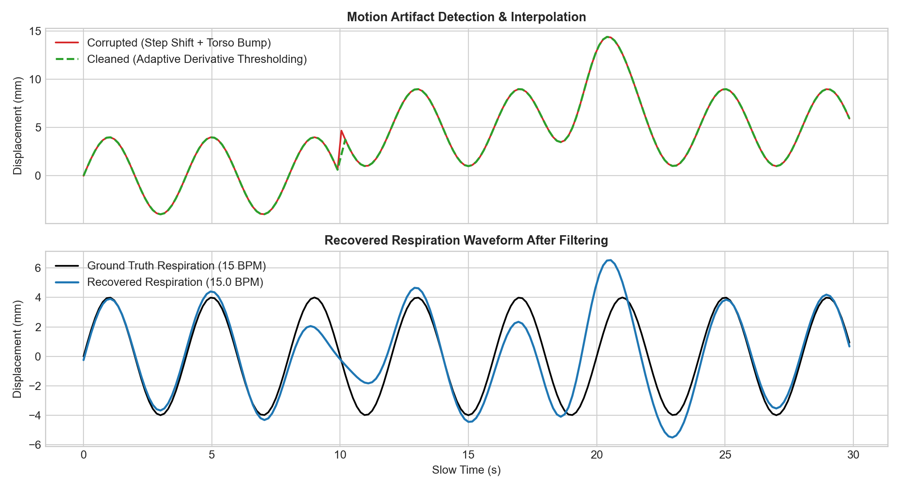
*Figure 9: Filtering sudden 5 mm posture shifts and 8 mm torso bumps to preserve respiration tracking (**15.04 BPM** recovered).*

#### Forensic Dataset Comparison
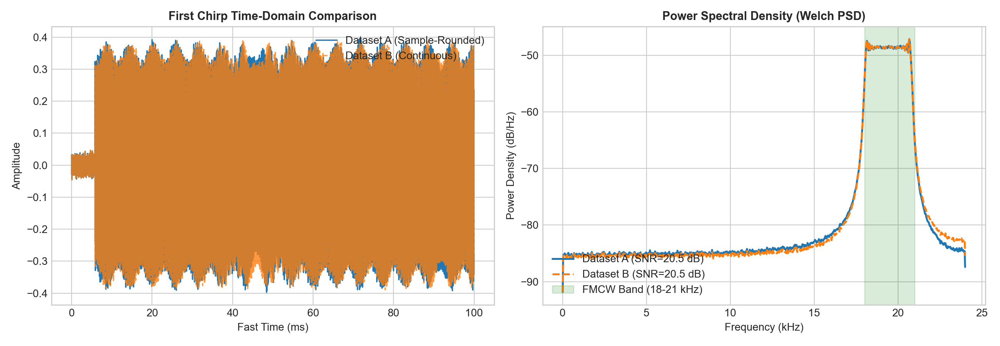
*Figure 10: Time-domain and Power Spectral Density (PSD) comparison between sample-rounded and continuous datasets.*

---

### 5. Scientific Finding: Integer Rounding vs Continuous Delay

#### Phase Quantization in the Original Dataset
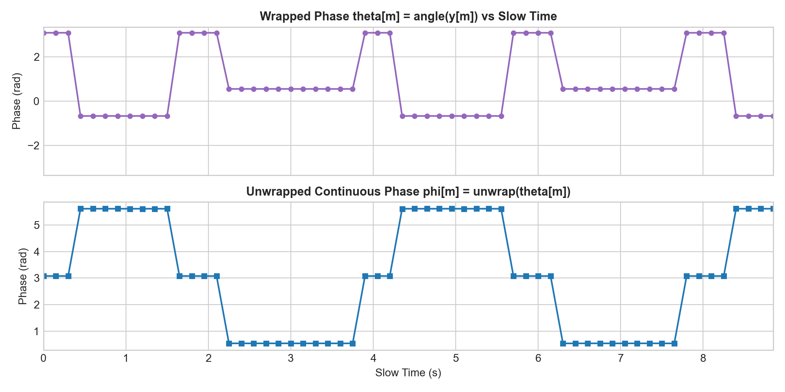
*Figure 11: In the original dataset, `delay_samples = int(round(tau * fs))` created 1-sample ($3.57\text{ mm}$) discrete jumps, producing a 3-level staircase phase.*

#### Continuous Fractional-Delay Model (Benchmark)
When continuous propagation delay $\tau(t) = \frac{2R(t)}{c}$ is evaluated without integer rounding (`generate_role1_improved_simulation.py`):
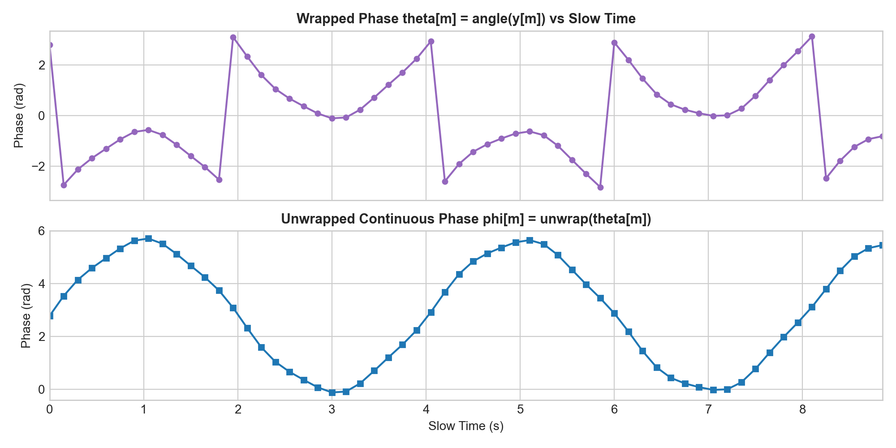
*Figure 12: True continuous sinusoidal phase modulation.*

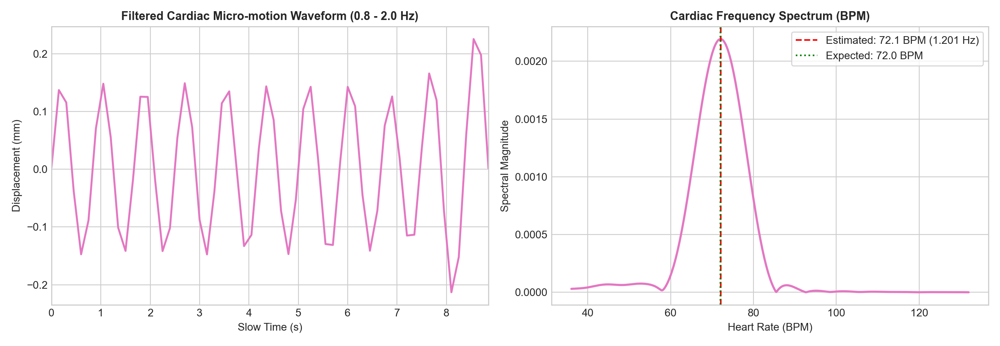
*Figure 13: Successful recovery of cardiac micro-motion (**72.07 BPM** vs Expected **72.00 BPM**, Amplitude: **0.15 mm**).*

---

## 📈 Quantitative Validation Summary

| Metric | Ground Truth Reference | Primary Dataset (Original) | Continuous Model (Benchmark) | Status |
| :--- | :--- | :--- | :--- | :--- |
| **Target Range ($R$)** | $1.000\text{ m}$ | **$1.0004\text{ m}$** (Error: $0.42\text{ mm}$) | **$1.0004\text{ m}$** | **PASS** |
| **Beat Frequency ($f_b$)** | $174.93\text{ Hz}$ | **$175.00\text{ Hz}$** | **$175.00\text{ Hz}$** | **PASS** |
| **Respiration Rate** | $15.00\text{ BPM}$ | **$14.63\text{ BPM}$** (Error: $0.37\text{ BPM}$) | **$14.63\text{ BPM}$** | **PASS** |
| **Respiration Amplitude**| $4.00\text{ mm}$ | **$4.83\text{ mm}$** | **$4.74\text{ mm}$** | **PASS** |
| **Heart Rate** | $72.00\text{ BPM}$ | Degraded (Quantized Steps) | **$72.07\text{ BPM}$** (Error: $0.07\text{ BPM}$) | **BENCHMARK OK** |
| **Cardiac Amplitude** | $0.150\text{ mm}$ | Step Noise | **$0.150\text{ mm}$** | **BENCHMARK OK** |
| **AWGN Noise Tolerance**| $30\text{ dB} - 5\text{ dB}$ | - | **Passed** ($\\le 1.72\text{ BPM}$ error @ 5dB) | **PASS** |
| **Motion Artifact Removal**| Posture / Torso | - | **15.04 BPM Recovered** (Error: $0.04\text{ BPM}$) | **PASS** |

---

## 🚀 Getting Started & Execution

### 1. Clone the Repository
```bash
git clone https://github.com/sanjaikumaar20-dot/acoustic-fmcw-radar-vital-signs.git
cd acoustic-fmcw-radar-vital-signs
```

### 2. Requirements
```bash
pip install numpy scipy matplotlib
```

### 3. Run the Complete Simulation Suite
```bash
python run_simulation.py
```

### 4. Standalone Modular Execution
```bash
# Run Role 2 FMCW Radar DSP standalone
python role2_fmcw_processing.py

# Run Role 3 Vital Sign Processing standalone
python role3_vital_sign_processing.py

# Run Noise Robustness Test
python -c "from role3.noise_robustness_test import run_noise_robustness_test; run_noise_robustness_test()"

# Run Motion Artifact Test
python -c "from role3.motion_artifact_test import run_motion_artifact_test; run_motion_artifact_test()"

# Run Forensic Dataset Comparison
python -c "from role1.dataset_comparison import run_dataset_comparison; run_dataset_comparison()"
```

---

## 📁 Repository Structure

```
.
├── config.json                         # Radar & target configuration parameters
├── README_ROLE2_HANDOFF.txt            # Role 1 -> Role 2 interface contract
├── rx_audio.npy                        # Primary simulated acoustic audio (48 kHz)
├── tx_signal.npy                       # Primary FMCW chirp signal
├── verify.py                           # Quick sanity verification script
├── run_simulation.py                   # Master end-to-end execution script
├── role2_fmcw_processing.py            # Role 2 FMCW Radar DSP module
├── role3_vital_sign_processing.py      # Role 3 Vital Sign DSP module
├── generate_role1_simulation.py        # Original synthetic signal generator
├── generate_role1_improved_simulation.py # Continuous fractional-delay generator
├── generate_pdf.py                     # 6-page PDF compiler
├── Acoustic_FMCW_Radar_Simulation_Graphs.pdf # Full visual report
│
├── role1/                              # Role 1 module package
│   ├── __init__.py
│   ├── generator.py                    # Synthetic signal generation & continuous simulation
│   └── dataset_comparison.py           # Forensic dataset comparison engine
│
├── role2/                              # Role 2 module package
│   ├── __init__.py
│   ├── radar_dsp.py                    # Modular DechirpEngine, RangeFFTEngine, StaticClutterCanceller
│   ├── target_tracker.py               # Multi-candidate tracking & multipath rejection
│   └── synthetic_validation.py         # Multi-target distance validation suite
│
├── role3/                              # Role 3 module package
│   ├── __init__.py
│   ├── vital_sign_dsp.py               # Phase extraction, unwrapping, BPM estimation
│   ├── realtime_processor.py           # Streaming causal sample-by-sample processor
│   ├── noise_robustness_test.py        # AWGN SNR sensitivity test (30dB, 20dB, 10dB, 5dB)
│   └── motion_artifact_test.py         # Posture shift, cough/torso bump, tremor mitigation
│
├── outputs/                            # Generated intermediate .npy & results
│   ├── range_profile.npy
│   ├── range_axis.npy
│   ├── target_bin_slow_time.npy
│   ├── displacement_waveform.npy
│   ├── results.json
│   ├── noise_test_results.json
│   ├── motion_artifact_results.json
│   ├── dataset_comparison_report.json
│   ├── Acoustic_FMCW_Radar_Simulation_Graphs.pdf
│   └── improved_model/
│
└── plots/                              # Generated high-resolution diagnostic graphs
    ├── tx_chirp.png
    ├── rx_audio.png
    ├── spectrogram.png
    ├── range_profile.png
    ├── target_bin_magnitude.png
    ├── target_phase.png
    ├── displacement.png
    ├── respiration_spectrum.png
    ├── cardiac_spectrum.png
    ├── noise_robustness_comparison.png
    ├── motion_artifact_mitigation.png
    ├── dataset_forensic_comparison.png
    └── improved_model/
```

---

## 📜 License
This project is licensed under the MIT License.
