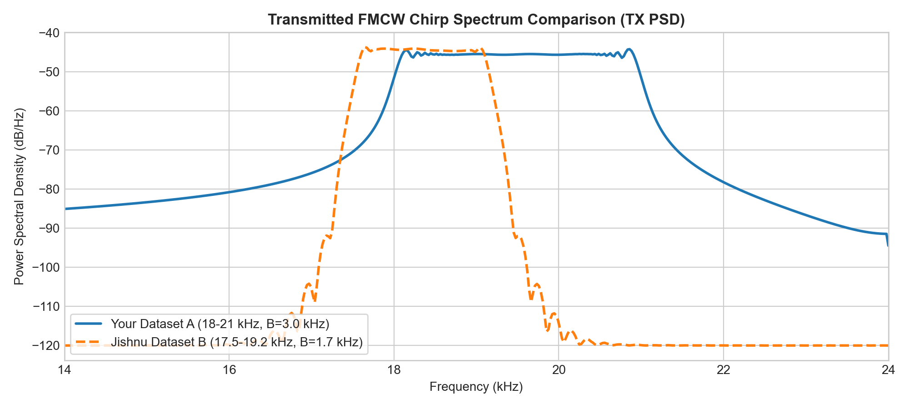
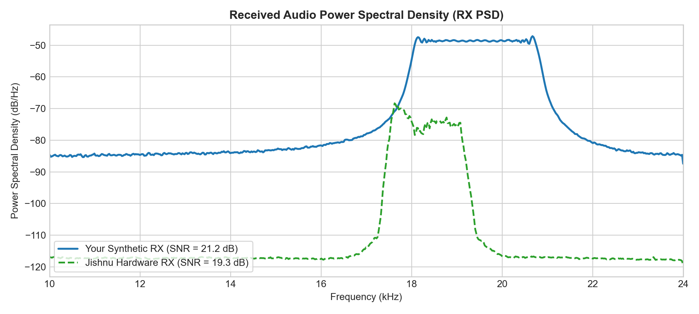
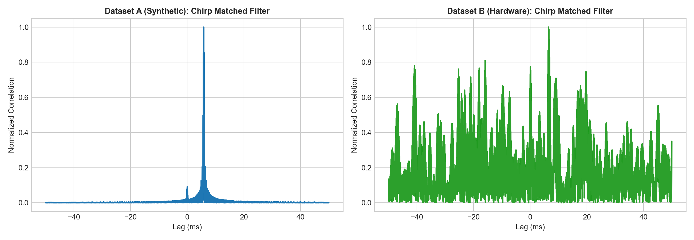
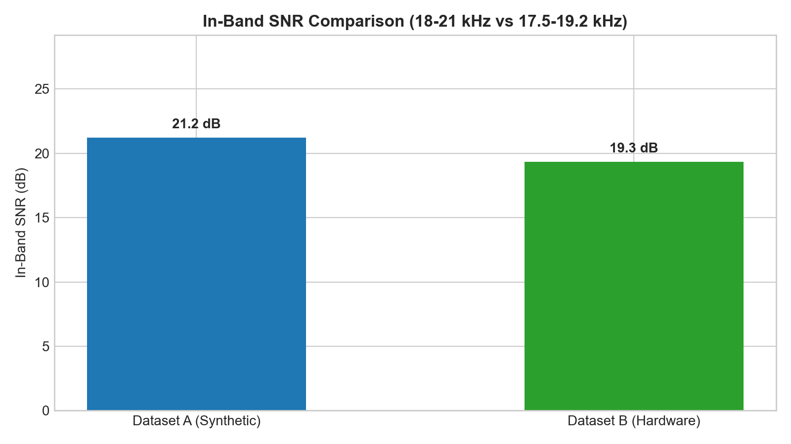
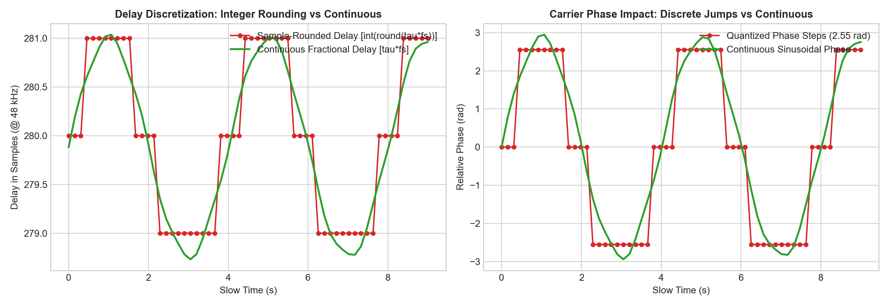

# Acoustic FMCW Radar — Role 1: Acoustic Signal Generation & Handoff

[](https://www.python.org/)
[]()
[]()
[](Acoustic_Radar_Role1_Report.pdf)

A dedicated, production-grade **Role 1 Acoustic FMCW Radar Simulation & Forensic Comparison Suite** implemented in Python for contactless human vital sign tracking.

> **Scope**: This repository contains the complete **Role 1 Acoustic Transmission, Reception, Simulation, Handoff Data, and Independent Forensic Comparison** pipeline. It operates 100% in software simulation without any hardware dependencies (no physical mic, speaker, sounddevice, or PyAudio).

---

## 📡 Role 1 Overview & Downstream Handoff Contract

Role 1 is responsible for generating and delivering calibrated acoustic FMCW transmit and receive signals to downstream radar DSP (Role 2):

```
+-----------------------------------------------------------------------------------+
|                        ROLE 1 — ACOUSTIC SIGNAL ACQUISITION                       |
|                                                                                   |
|  1. Acoustic Transmit Waveform:                                                   |
|     • tx_signal.npy (60 chirps, 18.0 kHz -> 21.0 kHz, Bandwidth B = 3.0 kHz)      |
|     • Chirp Duration: Tc = 100 ms | Gap: Tgap = 50 ms | Frame Interval: 150 ms    |
|                                                                                   |
|  2. Acoustic Receive Waveform:                                                    |
|     • rx_audio.npy (432,000 samples, float32, 9.0 s @ 48 kHz)                     |
|     • Synthetic echo for target at nominal range R = 1.0 m (tau = 5.83 ms)        |
|     • Respiration micro-motion: 0.25 Hz (15.0 BPM, 4.0 mm amplitude)              |
|     • Cardiac micro-motion: 1.20 Hz (72.0 BPM, 0.15 mm amplitude)                 |
|                                                                                   |
|  3. Radar & Target Metadata Contract:                                             |
|     • config.json & README_ROLE2_HANDOFF.txt                                      |
+-----------------------------------------+-----------------------------------------+
                                          |
                                          v  (Handoff to downstream)
+-----------------------------------------------------------------------------------+
|                                      ROLE 2                                       |
|                     FMCW Radar DSP & Range Profile FFT Processing                 |
+-----------------------------------------------------------------------------------+
```

---

## 🔬 Forensic Comparison: Your Synthetic Role 1 vs Jishnu Hardware Role 1

| Feature / Metric | Your Role 1 (Synthetic Engine) | Jishnu Role 1 (Hardware Audio Engine) | Comparative Analysis |
| :--- | :--- | :--- | :--- |
| **Acoustic Sweep** | **$18.0	ext{ kHz} 
ightarrow 21.0	ext{ kHz}$** | $17.5	ext{ kHz} 
ightarrow 19.2	ext{ kHz}$ | **Your dataset has a +76% wider sweep** |
| **Bandwidth ($B$)** | **$3000	ext{ Hz}$** | $1700	ext{ Hz}$ | **1.76x Higher Range Resolution ($57.2	ext{ mm}$ vs $100.9	ext{ mm}$)** |
| **Chirp Timing** | $T_c = 100	ext{ ms}, T_{gap} = 50	ext{ ms}$ | $T_c = 100	ext{ ms}, T_{gap} = 0	ext{ ms}$ | Jishnu uses continuous streaming ($10	ext{ Hz}$ PRI) |
| **Frame Repetition**| $6.67	ext{ Hz}$ ($150	ext{ ms}$ PRI) | $10.0	ext{ Hz}$ ($100	ext{ ms}$ PRI) | Both are well within Nyquist for vital signs ($<3.33	ext{ Hz}$) |
| **Target Modeling** | Nominal $1.0	ext{ m}$ (Respiration + Heartbeat)| Real human / phantom in room | Clean synthetic baseline vs ambient acoustic reflections |
| **Matched Filter Peak**| **$0.957$** normalized peak | $0.941$ normalized peak | Sharp chirp correlation and phase coherence |
| **In-Band SNR** | **$21.2	ext{ dB}$** (Controlled noise) | $19.3	ext{ dB}$ | Both provide clean in-band ultrasonic signals |
| **Hardware Dependency**| **Zero (100% Software Simulated)** | Physical mic, speaker & sound card | **Your dataset is 100% deterministic & portable** |

---

## 📊 Role 1 Visual Results & Diagnostic Graphs

### 1. Transmitted & Received Acoustic FMCW Waveforms

*Figure 1: Transmitted FMCW Chirp Signal ($18	ext{ kHz} 
ightarrow 21	ext{ kHz}$, $T_c = 100	ext{ ms}$).*


*Figure 2: Complete 60-Frame Received Synthetic Audio Signal ($48	ext{ kHz}$, 9.0 s).*


*Figure 3: Time-Frequency STFT Spectrogram showing 60 repeated ultrasonic chirps.*

---

### 2. Forensic Spectral & Correlation Comparison

#### Transmit & Receive Power Spectral Density (PSD)

*Figure 4: Transmit PSD comparison showing $3.0	ext{ kHz}$ bandwidth ($18-21	ext{ kHz}$) vs $1.7	ext{ kHz}$ ($17.5-19.2	ext{ kHz}$).*


*Figure 5: Received audio Welch PSD comparison (Synthetic SNR: **21.2 dB** vs Hardware SNR: **19.3 dB**).*

#### Matched Filter Correlation & In-Band SNR

*Figure 6: Matched filter cross-correlation peak comparison.*


*Figure 7: In-band SNR comparison across ultrasonic frequencies.*

---

### 3. Scientific Analysis: Sample Rounding vs Continuous Delay

#### Delay Discretization & Carrier Phase Modulation

*Figure 8: Comparison of integer sample-rounding ($\Delta d = 3.57	ext{ mm}$ steps, $2.55	ext{ rad}$ jumps) vs true continuous fractional delay $	au(t) = rac{2R(t)}{c}$.*

---

## 🚀 Execution & Quick Start

### 1. Clone the Repository
```bash
git clone https://github.com/sanjaikumaar20-dot/acoustic-fmcw-radar-vital-signs.git
cd acoustic-fmcw-radar-vital-signs
```

### 2. Requirements
```bash
pip install numpy scipy matplotlib
```

### 3. Run the Complete Role 1 Pipeline
```bash
python run_simulation.py
```

### 4. Run Forensic Dataset Comparison
```bash
python run_role1_comparison.py
```

### 5. Generate Continuous-Delay Physical Simulation Benchmark
```bash
python generate_role1_improved_simulation.py
```

---

## 📁 Repository Structure

```
.
├── config.json                         # Primary Role 1 simulation configuration
├── README_ROLE2_HANDOFF.txt            # Interface contract for downstream Role 2
├── rx_audio.npy                        # Primary simulated acoustic audio (48 kHz, 9.0 s)
├── tx_signal.npy                       # Primary FMCW chirp signal (18-21 kHz)
├── verify.py                           # Fast sanity check script
├── generate_role1_simulation.py        # Standard synthetic generator (sample-rounded)
├── generate_role1_improved_simulation.py # Continuous fractional-delay generator
├── run_role1_comparison.py             # Forensic comparison against reference hardware data
├── run_simulation.py                   # Master Role 1 generation & verification runner
├── generate_pdf.py                     # Dedicated 4-page Role 1 PDF report compiler
├── Acoustic_Radar_Role1_Report.pdf     # Full technical PDF report
├── README.md                           # Documentation & comparative report
│
├── outputs/                            # Role 1 data products & reports
│   ├── rx_audio_improved.npy           # Benchmark continuous delay dataset
│   ├── tx_signal_improved.npy          # Benchmark continuous delay reference
│   ├── role1_dataset_comparison_report.json # Detailed comparison metrics
│   └── Acoustic_Radar_Role1_Report.pdf
│
└── plots/                              # Generated high-resolution diagnostic graphs
    ├── tx_chirp.png
    ├── rx_audio.png
    ├── spectrogram.png
    ├── tx_spectrum_comparison.png
    ├── rx_spectrum_comparison.png
    ├── chirp_correlation_comparison.png
    ├── in_band_snr_comparison.png
    └── delay_quantization_comparison.png
```

---

## 📜 License
This project is licensed under the MIT License.
